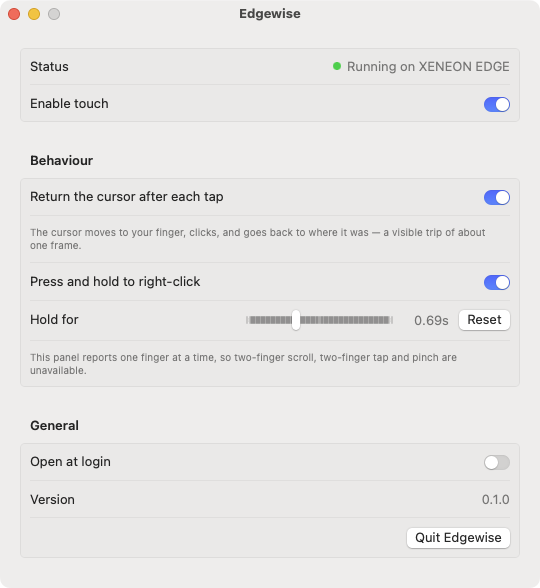

# Edgewise

**Taps land where you touch.** A macOS touch driver for the Corsair Xeneon Edge.

[](https://github.com/mrchess/edgewise/actions/workflows/ci.yml)


[](LICENSE)

macOS has no native touchscreen support, so it reads the panel as a *relative* pointing
device — your finger nudges the cursor from wherever it already sat, like a trackpad.
Edgewise claims the panel from macOS and turns its raw touch reports into clicks where
you actually touched.

📄 **[Project page](https://mrchess.github.io/edgewise/)** — how it works, and what this
hardware will and will not do.

<p align="center">
  
</p>

## What works

| Gesture | Result |
| --- | --- |
| Tap | Click, exactly where you touched |
| Double-tap | A real double-click — opens folders, selects words |
| Press and hold | Right-click, with an adjustable hold time |
| Drag | Press, move, release |

The cursor travels to your finger, clicks, and returns to where it was — about one
frame — so you can hit a control on the panel without losing your place on the main
display. Turn the return off if you would rather it stayed where you tapped.

## What does not

**Multi-finger gestures.** Two-finger scroll, two-finger tap and pinch are implemented
and unit-tested, but the panel never reports a second contact on macOS, so they are
hidden rather than offered. Not a limitation of the driver, and not — despite the common
claim — of the hardware. See [below](#multi-finger-gestures-cannot-work-on-macos).

**Brightness, colour and resolution.** Edgewise handles touch input only. The panel
answers DDC/CI, so [MonitorControl](https://github.com/MonitorControl/MonitorControl)
covers picture settings. For larger text you need
[BetterDisplay](https://github.com/waydabber/BetterDisplay): macOS lists a half-size
Retina mode for this panel but refuses to set it — both `CGDisplaySetDisplayMode` and a
display configuration transaction return `kCGErrorIllegalArgument` — so no application
can select it.

## Install

1. Download `Edgewise.dmg` from [Releases](../../releases).
2. Drag Edgewise to Applications.
3. Open it. It walks you through the two permissions macOS requires.

Edgewise then runs invisibly — no Dock icon, no menu bar item, no window unless you ask
for one. **Open it again from Applications** to reach its settings; that works whether or
not it is already running.

Start-at-login registers a LaunchAgent from inside the app bundle, so launchd relaunches
it if it ever crashes, and it appears in System Settings → General → Login Items where
you can revoke it. To uninstall, drag the app to the Trash — there is nothing in
`/usr/local/bin` and no plist to hunt down.

**Requirements:** macOS 13 or later. Universal binary, Apple Silicon and Intel.

## Configuration

Everything is in the app's settings. The underlying file is
`~/Library/Application Support/Edgewise/config.json`.

| Setting | Default | Notes |
| --- | --- | --- |
| `restoreCursor` | on | Return the cursor to where it was after each tap |
| `longPressRightClick` | on | Press and hold for a right-click |
| `longPressDelay` | 0.5s | Adjustable from 0.05s to 2s |
| `dragThreshold` | 4pt | How far a finger moves before a tap becomes a drag |
| `startAtLogin` | on | LaunchAgent, relaunched on crash |

Rotation is read from `CGDisplayRotation`, so rotating the display in System Settings
carries the touch mapping with it at all four angles. The panel is identified by its
EDID name, then by its exact size; if neither matches, Edgewise does nothing and says so
rather than clicking on the wrong screen, and offers a picker so you can choose it.

## Diagnostics

`edgewise-diag` ships inside the app bundle. It never posts an event, so it is always
safe to run.

```bash
/Applications/Edgewise.app/Contents/MacOS/edgewise-diag doctor
```

| Command | Purpose |
| --- | --- |
| `doctor` | Check permissions, panel, and display mapping |
| `devices` | List panels and the HID usages they report |
| `displays` | Show every display and which one resolves as the panel |
| `record <file> [seconds]` | Capture a gesture to a test fixture |
| `replay <file>` | Replay a fixture and print the gestures it produced |

The CLI is a separate TCC subject from the app: run from a terminal, its permission
checks describe *the terminal*, not Edgewise.

## Multi-finger gestures cannot work on macOS

Not "not yet" — as far as anyone has established, not at all, from any macOS software.

The panel presents three interfaces: a ten-finger digitizer, a vendor channel
(`0xFF0A`), and a mouse-emulation interface. On macOS it transmits only on the mouse
interface; across thousands of captured reports the digitizer sent nothing. On Windows
the host writes `SET_REPORT Feature 0x21 = [21 02 00]` and multi-touch begins streaming
about 3ms later.

[Myseri/xeneon-edge-multitouch-macos](https://github.com/Myseri/xeneon-edge-multitouch-macos)
did the definitive work: a USBPcap capture of the Windows unlock, and a DriverKit driver
that replays it byte-for-byte. Their
[diagnostic log](https://github.com/Myseri/xeneon-edge-multitouch-macos/blob/main/docs/DIAGNOSTIC_LOG.md)
records what has been eliminated on real hardware — the byte-exact replay, both
`SET_REPORT` framings at both the HID and raw USB layers, and UPDD claiming the whole
composite device exclusively. Three independent stacks fail identically.

Their surviving hypothesis is that the firmware fingerprints the host OS during **bus
enumeration**, before any driver loads, and honours the mode switch only when that
fingerprint says Windows.

Edgewise still attempts the switch at startup — it costs nothing and would begin working
the day a firmware or OS change allows it — and the gesture recogniser handles multiple
contacts and is tested for them.

## Testing

The core is pure: parsing, coordinate mapping, display resolution and gesture
recognition perform no I/O and take "now" from the caller, so every timing rule is tested
without sleeping. Hardware behaviour is covered by recording real HID streams to JSON
fixtures and replaying them through the production pipeline, which keeps it under test on
machines with no panel attached. See [docs/QA.md](docs/QA.md).

```bash
swift test
```

## Building

```bash
swift test && ./Scripts/build-app.sh
```

Produces `dist/Edgewise.app` and a DMG. The build finds a signing identity itself,
preferring Developer ID over Apple Development. Set `NOTARY_PROFILE` to a stored
`notarytool` profile to notarise and staple.

## Credits

An independent MIT implementation that draws on prior MIT-licensed work:

- [ymlaine/TouchscreenDriver](https://github.com/ymlaine/TouchscreenDriver) — the
  original seize-and-map approach, and the panel's USB identity.
- [alax's PR #2](https://github.com/ymlaine/TouchscreenDriver/pull/2) — found that the
  panel reports its touch flag only on transitions, which is why drag never worked.
- [ajvwhite/MacXeneonEdgeTouchDriver](https://github.com/ajvwhite/MacXeneonEdgeTouchDriver)
  — protocol-oriented structure, tests, and display matching by serial.
- [bencolson/Touchdown](https://github.com/bencolson/Touchdown) — showed the same
  controller drives panels beyond the Xeneon.
- [Myseri/xeneon-edge-multitouch-macos](https://github.com/Myseri/xeneon-edge-multitouch-macos)
  — established that the multi-touch unlock cannot be reproduced on macOS, and saved
  this project from chasing it further.
- [aabdelghani/corsair-xeneon-edge-linux](https://github.com/aabdelghani/corsair-xeneon-edge-linux)
  — showed the panel's picture controls are reachable over DDC/CI.

## Licence

MIT. See [LICENSE](LICENSE), which also carries the copyright notices of the projects
credited above. Not affiliated with Corsair; "Xeneon" is a Corsair trademark, used here
only to say what the driver is for.
